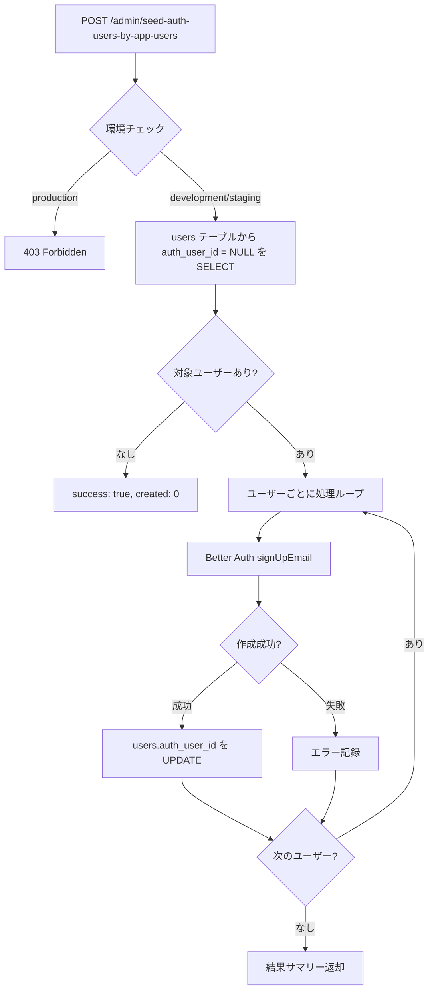

# Admin Seed Endpoint Design

**作成日:** 2025-12-19
**対象:** Remote Cloudflare D1 への auth_user 初期データ投入

## 概要

Remote 環境の Cloudflare D1 に `auth_user` の初期データを作成するための管理者用エンドポイントを追加する。

## 要件

### 機能要件

1. **auth_users に含まれない users を検出**
   - `users` テーブルから `auth_user_id` が `NULL` のレコードを SELECT
   - 既に auth_user とリンク済みのユーザーはスキップ

2. **auth_users を作成**
   - 検出された users に対して Better Auth の `signUpEmail` API を使用
   - パスワードは固定値 `"Password"` を使用
   - 作成成功後、`users.auth_user_id` を更新してリンク

3. **冪等性**
   - 複数回実行しても安全
   - 既に auth_user が存在する場合はスキップ

### 非機能要件

1. **セキュリティ**
   - 開発環境でのみ有効（環境変数でガード）
   - 本番環境では 403 Forbidden を返す

2. **エラーハンドリング**
   - 個別ユーザーの作成失敗時も処理を継続
   - 詳細なエラーレポートを返却

3. **透明性**
   - 作成成功/失敗/スキップの詳細を返す
   - ログ出力で処理状況を追跡可能

## エンドポイント仕様

### 基本情報

- **Path:** `/admin/seed-auth-users-by-app-users`
- **Method:** `POST`
- **認証:** 環境変数による制限（`ENVIRONMENT !== 'production'`）

### リクエスト

```http
POST /admin/seed-auth-users-by-app-users
Content-Type: application/json
```

**Body:** なし（パラメータ不要）

### レスポンス

#### 成功時 (200 OK)

```json
{
  "success": true,
  "summary": {
    "total": 20,
    "created": 15,
    "skipped": 5,
    "failed": 0,
    "syncErrors": 1
  },
  "results": [
    {
      "chatUserId": "550e8400-e29b-41d4-a716-446655440001",
      "username": "alice",
      "status": "created",
      "authUserId": "auth_123456"
    },
    {
      "chatUserId": "550e8400-e29b-41d4-a716-446655440002",
      "username": "bob",
      "status": "skipped",
      "reason": "Already has auth_user_id"
    },
    {
      "chatUserId": "550e8400-e29b-41d4-a716-446655440003",
      "username": "carol",
      "status": "failed",
      "error": "Username already exists"
    },
    {
      "chatUserId": "550e8400-e29b-41d4-a716-446655440004",
      "username": "dave",
      "status": "sync_error",
      "authUserId": "auth_789012",
      "error": "auth_user created but failed to update users.auth_user_id"
    }
  ]
}
```

**ステータス種別:**
- `created` - auth_user作成 + users.auth_user_id更新 成功
- `skipped` - 既にauth_user_idが設定済み
- `failed` - auth_user作成失敗
- `sync_error` - auth_user作成成功だがusers.auth_user_id更新失敗（要手動対応）

#### 環境制限エラー (403 Forbidden)

```json
{
  "success": false,
  "error": "Forbidden - only available in non-production environments",
  "environment": "production"
}
```

#### サーバーエラー (500 Internal Server Error)

```json
{
  "success": false,
  "error": "Failed to process seed operation",
  "details": "..."
}
```

## 処理フロー



## 実装詳細

### 1. ルーティング

```typescript
// src/routes/admin/index.ts
import { Hono } from 'hono'
import { seedAuthUsersByAppUsers } from './seed'

const app = new Hono()

app.post('/seed-auth-users-by-app-users', seedAuthUsersByAppUsers)

export default app
```

### 2. ハンドラー実装

```typescript
// src/routes/admin/seed.ts
import { Context } from 'hono'
import { createAuth } from '@/infrastructure/auth/config'
import { db } from '@/infrastructure/db/client'
import { users as chatUsers } from '@/infrastructure/db/schema'
import { isNull } from 'drizzle-orm'

const DEFAULT_PASSWORD = 'Password'

export async function seedAuthUsersByAppUsers(c: Context) {
  // 環境チェック
  const environment = c.env.ENVIRONMENT || 'development'
  if (environment === 'production') {
    return c.json({
      success: false,
      error: 'Forbidden - only available in non-production environments',
      environment
    }, 403)
  }

  try {
    // Step 1: auth_user_id が NULL の users を取得
    const usersWithoutAuth = await db
      .select()
      .from(chatUsers)
      .where(isNull(chatUsers.authUserId))
      .all()

    if (usersWithoutAuth.length === 0) {
      return c.json({
        success: true,
        summary: { total: 0, created: 0, skipped: 0, failed: 0 },
        results: [],
        message: 'No users without auth_user_id found'
      })
    }

    // Step 2: Better Auth で auth_user を作成
    const auth = createAuth(c.env.DB)
    const results = []
    let createdCount = 0
    let skippedCount = 0
    let failedCount = 0
    let syncErrorCount = 0

    for (const user of usersWithoutAuth) {
      try {
        // Better Auth で auth_user 作成
        const result = await auth.api.signUpEmail({
          body: {
            username: user.idAlias,
            email: `${user.idAlias}@example.com`,
            password: DEFAULT_PASSWORD,
            name: user.name
          }
        })

        if (!result || !result.user) {
          results.push({
            chatUserId: user.id,
            username: user.idAlias,
            status: 'failed',
            error: 'Failed to create auth user'
          })
          failedCount++
          continue
        }

        // Step 3: users.auth_user_id を更新
        try {
          await db
            .update(chatUsers)
            .set({ authUserId: result.user.id })
            .where(eq(chatUsers.id, user.id))

          results.push({
            chatUserId: user.id,
            username: user.idAlias,
            status: 'created',
            authUserId: result.user.id
          })
          createdCount++
        } catch (updateError: any) {
          // auth_user は作成されたが users 更新に失敗
          results.push({
            chatUserId: user.id,
            username: user.idAlias,
            status: 'sync_error',
            authUserId: result.user.id,
            error: 'auth_user created but failed to update users.auth_user_id'
          })
          syncErrorCount++
          console.error(`Sync error for user ${user.idAlias}:`, updateError)
        }

      } catch (error: any) {
        // 既存ユーザーエラーはスキップ扱い
        if (error.message?.includes('already exists')) {
          results.push({
            chatUserId: user.id,
            username: user.idAlias,
            status: 'skipped',
            reason: error.message
          })
          skippedCount++
        } else {
          results.push({
            chatUserId: user.id,
            username: user.idAlias,
            status: 'failed',
            error: error.message || 'Unknown error'
          })
          failedCount++
        }
      }
    }

    return c.json({
      success: true,
      summary: {
        total: usersWithoutAuth.length,
        created: createdCount,
        skipped: skippedCount,
        failed: failedCount,
        syncErrors: syncErrorCount
      },
      results
    })

  } catch (error: any) {
    console.error('Seed operation failed:', error)
    return c.json({
      success: false,
      error: 'Failed to process seed operation',
      details: error.message
    }, 500)
  }
}
```

### 3. メインルーターへの追加

```typescript
// src/index.ts
import admin from './routes/admin'

app.route('/admin', admin)
```

### 4. npm スクリプト追加

```json
// apps/backend/package.json
{
  "scripts": {
    "d1:seed:users:remote": "wrangler d1 execute prototype-hono-drizzle-db --remote --file=./drizzle/seed/0001_users.sql",
    "d1:seed:users:local": "wrangler d1 execute prototype-hono-drizzle-db --local --file=./drizzle/seed/0001_users.sql",
    "operation:seed:auth-users:remote": "curl -X POST https://prototype-hono-drizzle-backend.linnefromice.workers.dev/admin/seed-auth-users-by-app-users",
    "operation:seed:auth-users:local": "curl -X POST http://localhost:3000/admin/seed-auth-users-by-app-users",
    "d1:reset:remote": "npm run d1:clean:remote && npm run d1:migrate:remote && npm run d1:seed:users:remote && npm run operation:seed:auth-users:remote",
    "d1:reset:local": "npm run d1:clean:local && npm run d1:migrate:local && npm run d1:seed:users:local && npm run operation:seed:auth-users:local"
  }
}
```

**スクリプト命名規則:**
- `d1:seed:users:*` - D1で直接usersテーブルへデータ投入
- `operation:seed:auth-users:*` - Admin APIでauth_usersを生成し、既存usersとリンク

## 環境変数

```bash
# wrangler.toml
[env.production]
ENVIRONMENT = "production"

[env.staging]
ENVIRONMENT = "staging"

[env.development]
ENVIRONMENT = "development"
```

## セキュリティ考慮事項

### 1. 環境制限

- ✅ 本番環境では必ず無効化（`ENVIRONMENT` チェック）
- ✅ 環境変数が未設定の場合はデフォルト `development` として扱う

### 2. 認証方式

- ✅ 環境変数（`ENVIRONMENT`）による制限のみ
- 📝 現時点ではシークレットトークン認証は不要
- 🔄 将来的に必要に応じて追加検討

### 3. パスワード管理

- ⚠️ 固定パスワード `"Password"` を使用
- 📝 開発/テスト環境専用であることを明記
- 📝 本番環境では使用しない（環境ガードで保護）

### 4. emailドメイン

- ✅ `@example.com` を使用
- 📝 開発/テスト環境での識別用途として適切

### 5. レート制限

- 現状: 環境ガードのみで十分と判断
- 🔄 必要に応じて将来検討

### 6. 監査ログ

- ✅ console.log で実行ログを記録
- ✅ レスポンスに詳細な実行結果を含める

## テスト計画

### 1. ユニットテスト

- [ ] 環境チェックロジック
- [ ] auth_user_id が NULL のユーザー検出
- [ ] Better Auth 連携処理
- [ ] users.auth_user_id 更新処理
- [ ] エラーハンドリング

### 2. 統合テスト

- [ ] 正常系: auth_user 作成 → users 更新
- [ ] 既存ユーザースキップ
- [ ] 重複実行時の冪等性
- [ ] 環境ガードの動作確認

### 3. 手動テスト

- [ ] ローカル環境での動作確認
- [ ] リモート (staging) 環境での動作確認
- [ ] 本番環境でのアクセス拒否確認

## 運用手順

### 初回セットアップ

1. バックエンドをデプロイ
2. `npm run d1:reset:remote` を実行
   - DB クリーンアップ
   - マイグレーション実行
   - users シード実行（D1で直接実行）
   - auth_users シード実行（Admin APIで生成）

### 既存環境への追加

1. `npm run operation:seed:auth-users:remote` を実行
   - 既存の users から auth_user を作成
   - 既にリンク済みのユーザーはスキップ

### トラブルシューティング

**問題: auth_user 作成失敗 (`status: "failed"`)**
- レスポンスの `results` 配列で該当レコードを確認
- `error` フィールドで原因を特定
- 必要に応じて手動で修正

**問題: users.auth_user_id が更新されない (`status: "sync_error"`)**
- auth_user は作成されたが users へのリンクが失敗
- レスポンスに含まれる `authUserId` を確認
- DB を直接確認して手動で UPDATE が必要:
  ```sql
  UPDATE users
  SET auth_user_id = 'auth_789012'
  WHERE id = '550e8400-e29b-41d4-a716-446655440004';
  ```
- サーバーログで詳細なエラー内容を確認

## 将来の拡張

### 1. カスタムパスワード対応

```typescript
// リクエストボディでパスワードを指定可能に
{
  "password": "CustomPassword123"
}
```

### 2. 特定ユーザーのみ処理

```typescript
// リクエストボディでユーザーIDを指定
{
  "userIds": ["550e8400-e29b-41d4-a716-446655440001", ...]
}
```

### 3. Dry-run モード

```typescript
// 実際には作成せず、処理予定を返す
{
  "dryRun": true
}
```

## 参考資料

- [Better Auth API Documentation](https://www.better-auth.com/docs)
- [Cloudflare D1 Documentation](https://developers.cloudflare.com/d1/)
- [Drizzle ORM Documentation](https://orm.drizzle.team/)
